# PySpark — Complete Interview Notes

*For a Data Engineer interview. Read top to bottom once, then use the section headers as flash-card prompts.*

---

## 1. Spark Architecture — the mental model

**Core idea: Spark is a driver that plans work, and executors that run it, coordinated by a cluster manager.**

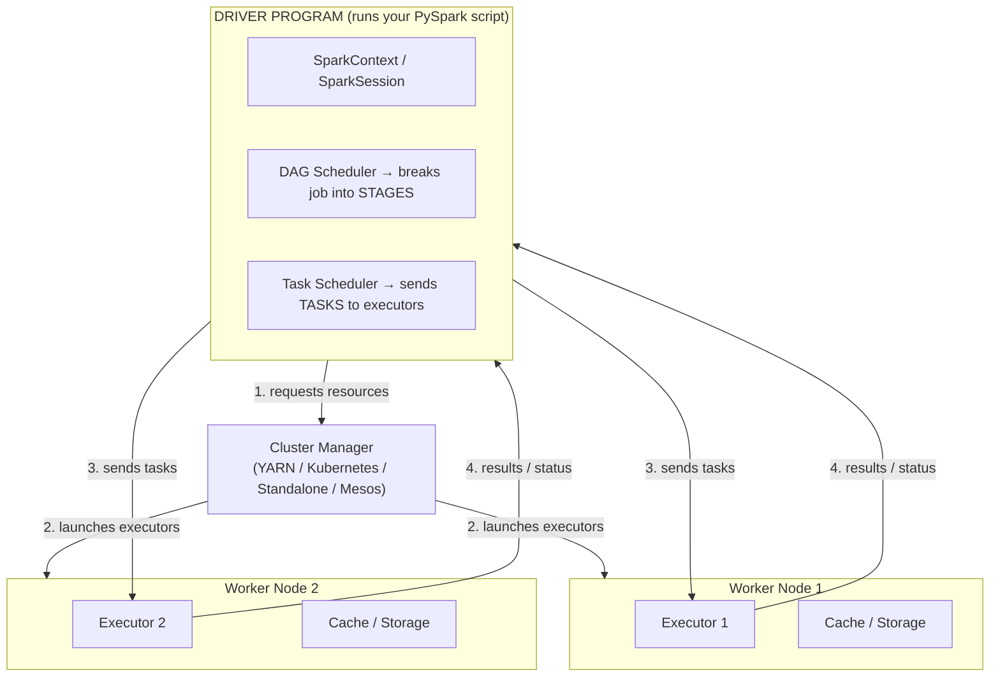

**Key vocabulary — memorize this hierarchy, it's asked constantly:**

| Term | What it is |
|---|---|
| **Application** | Your whole PySpark program, one SparkSession |
| **Job** | Triggered by one *action* (e.g. `.collect()`, `.count()`, `.write()`) |
| **Stage** | A chunk of a job with no shuffle inside it — a shuffle boundary creates a new stage |
| **Task** | The smallest unit of work — one task runs on one partition, on one core |

> **Mental model:** Job → Stages (split by shuffles) → Tasks (split by partitions). If you remember only one sentence for architecture questions, it's this one.

**Driver responsibilities:**
- Maintains the SparkContext / SparkSession
- Converts your code into a **DAG** (Directed Acyclic Graph) of operations
- Splits the DAG into stages at shuffle boundaries
- Schedules tasks onto executors and tracks their state

**Executor responsibilities:**
- Runs tasks (actual computation) in parallel threads
- Holds data in memory/disk for **caching**
- Reports results/status back to the driver

**Common interview trap:** *"What happens if the driver dies?"* → The whole application dies (single point of failure — no driver, no coordination). If an *executor* dies, Spark just re-schedules its tasks on another executor (that's why lineage/DAG matters — it can recompute lost partitions).

---

## 2. RDD vs DataFrame vs Dataset

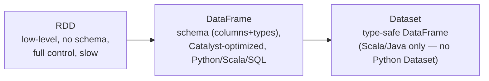

- **RDD** — distributed collection of objects, no optimizer, you manage everything manually. Rarely used directly today except for unstructured/custom logic.
- **DataFrame** — RDD + schema. Goes through the **Catalyst Optimizer**. This is what you use 95% of the time in PySpark.
- **Dataset** — type-safe DataFrame. **Doesn't exist in PySpark** (Python is dynamically typed) — only in Scala/Java. Interviewers sometimes test whether you know this.

**Why DataFrames are fast: Catalyst + Tungsten**

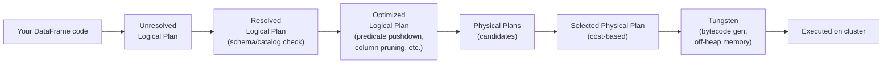

- **Catalyst Optimizer** — rewrites your logical query into an efficient plan (predicate pushdown, constant folding, column pruning).
- **Tungsten** — physical execution engine: manages memory off-heap (avoids JVM garbage collection overhead) and generates optimized bytecode at runtime (whole-stage code generation).

**Lazy evaluation** — transformations (`filter`, `select`, `withColumn`, `join`, `groupBy`) don't run immediately. They just build up the logical plan. Nothing executes until an **action** (`count`, `collect`, `show`, `write`, `take`) is called. This is what lets Catalyst see the *entire* chain of operations and optimize it globally instead of step by step.

| Transformations (lazy) | Actions (trigger execution) |
|---|---|
| `select`, `filter`/`where`, `withColumn`, `join`, `groupBy`, `orderBy`, `distinct`, `union` | `show()`, `count()`, `collect()`, `take()`, `write.save()`, `foreach()` |

---

## 3. DataFrames — the workhorse

```python
from pyspark.sql import SparkSession
from pyspark.sql import functions as F

spark = SparkSession.builder.appName("interview").getOrCreate()

df = spark.read.parquet("s3://bucket/orders/")

df2 = (
    df.filter(F.col("status") == "SHIPPED")
      .withColumn("order_month", F.month("order_date"))
      .groupBy("order_month")
      .agg(F.sum("amount").alias("total_amount"))
)

df2.explain(True)   # ALWAYS know this command — shows the physical/logical plan
```

**Things you should be able to say fluently in an interview:**
- `df.explain()` — shows you the plan Catalyst chose; use `explain(True)` or `explain("formatted")` to see all 4 stages of the plan (parsed → analyzed → optimized → physical).
- Schema is either **inferred** (`inferSchema=True`, slower — extra read pass) or **explicitly defined** with `StructType` (faster, safer, preferred in production pipelines).
- `df.repartition()`, `df.coalesce()`, `df.cache()`, `df.persist()` are the four you'll be grilled on — covered below.

---

## 4. Partitions — Coalesce vs Repartition

**Mental model: a DataFrame is split into partitions, and each partition is processed by one task on one core. How many partitions you have controls parallelism.**

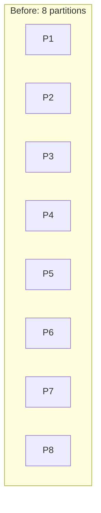

### `repartition(n)` — full shuffle, even distribution

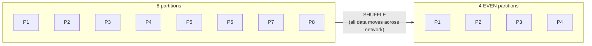

- Triggers a **full shuffle** — data moves across the network/executors.
- Can **increase or decrease** partition count.
- Produces roughly **evenly sized** partitions (good downstream parallelism).
- Use when: you need to **increase** partitions, or fix a **skewed** partition distribution, or repartition by a **column** before a join (`df.repartition("customer_id")`) to co-locate matching keys.
- Expensive — shuffles = network I/O + disk spill risk.

### `coalesce(n)` — no full shuffle, just merges

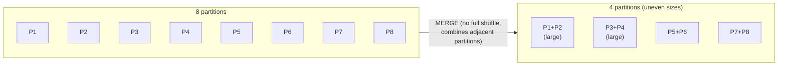

- **Only decreases** partitions (can't increase with coalesce).
- Avoids a full shuffle — just merges existing partitions together → **cheaper**.
- Can produce **uneven partitions** (some tasks do way more work than others).
- Classic use: reducing partition count **right before writing output** (e.g. `df.coalesce(1).write.csv(...)` to get one output file) — cheaper than `repartition(1)`.

| | `coalesce()` | `repartition()` |
|---|---|---|
| Shuffle | No full shuffle (narrow-ish) | Full shuffle |
| Can increase partitions? | ❌ No | ✅ Yes |
| Partition sizes | Uneven | Even |
| Cost | Cheap | Expensive |
| Typical use | Reducing partitions before write | Increasing partitions / fixing skew / pre-join repartitioning |

> **Interview one-liner:** *"Coalesce avoids a shuffle by merging existing partitions, so it's cheap but can leave data unevenly distributed. Repartition does a full shuffle to redistribute data evenly, so it's expensive but necessary when I need more partitions or need to fix skew."*

---

## 5. Data Skew — the #1 real-world PySpark performance problem

**What it is:** some partitions hold way more data than others (usually because a join/groupBy key is unevenly distributed — e.g. 40% of orders belong to one `customer_id`). The task processing that huge partition becomes the bottleneck — the job waits on that one straggler task while everything else finishes early.

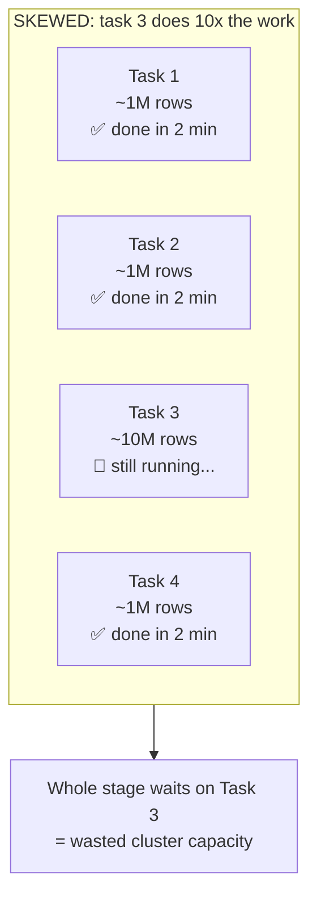

**How to detect it:**
- Spark UI → one task in a stage takes dramatically longer than the rest (look at the task duration distribution — a long tail is the signature).
- Symptoms: job "hangs" near the end, executor OOM errors on specific tasks, uneven shuffle read sizes per task.

### Fix #1: Adaptive Query Execution (AQE) — Spark's built-in auto-fix (Spark 3.0+)

AQE re-optimizes the query plan **at runtime**, using actual statistics from completed stages instead of relying only on the pre-execution plan.

```python
spark.conf.set("spark.sql.adaptive.enabled", "true")                       # on by default in Spark 3.2+
spark.conf.set("spark.sql.adaptive.skewJoin.enabled", "true")
spark.conf.set("spark.sql.adaptive.coalescePartitions.enabled", "true")
```

AQE does three things automatically:
1. **Dynamically coalesces shuffle partitions** — merges small post-shuffle partitions so you don't end up with thousands of tiny tasks.
2. **Dynamically splits skewed partitions in joins** — detects an oversized partition and splits it into smaller sub-partitions so multiple tasks can process it in parallel instead of one task carrying the whole load.
3. **Dynamically switches join strategy** — e.g. converts a sort-merge join to a broadcast join at runtime if it discovers one side is actually small.

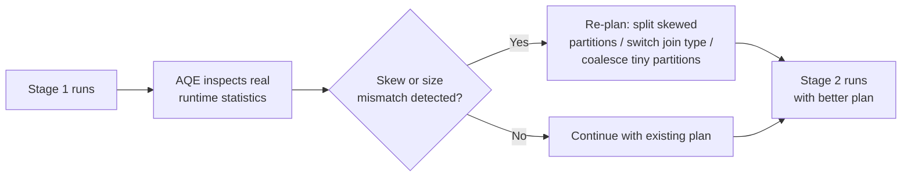

### Fix #2: Broadcast Joins — sidestep the shuffle entirely

**Mental model:** if one side of a join is small enough to fit in executor memory, send a **full copy of it to every executor** instead of shuffling both giant tables across the network.

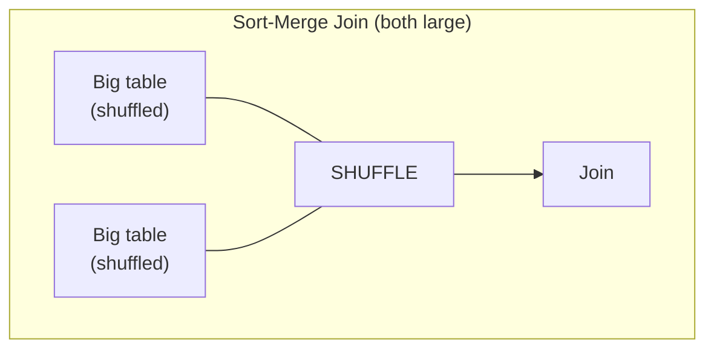

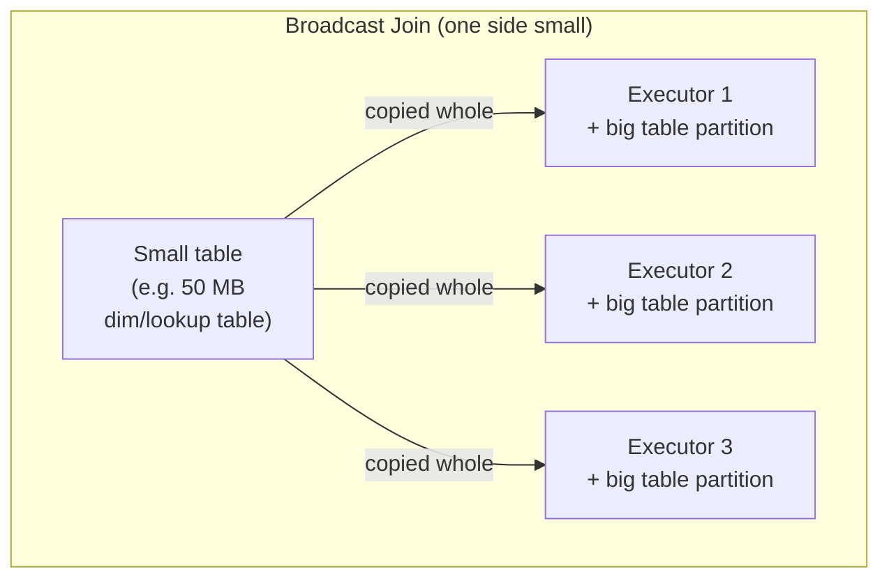

```python
from pyspark.sql.functions import broadcast

df_result = big_orders_df.join(broadcast(small_customers_df), "customer_id")

# threshold config — Spark auto-broadcasts if a table is under this size (default 10MB)
spark.conf.set("spark.sql.autoBroadcastJoinThreshold", 100 * 1024 * 1024)  # 100 MB
```

- **No shuffle on the big table** → huge speedup for star-schema-style joins (fact table + small dimension table).
- Only works when the small side genuinely fits comfortably in executor memory (rule of thumb: well under a few hundred MB per executor).
- Set threshold to `-1` to disable auto-broadcasting entirely (useful for debugging join plans).

### Fix #3: Salting — manual skew fix when AQE / broadcast aren't enough

Used when **both** sides of a join are large (so you can't broadcast) **and** one key is heavily skewed (so a plain shuffle still bottlenecks on that key).

**Idea:** add a random "salt" suffix to the skewed key so what was one giant partition becomes several smaller ones spread across more tasks.

```python
import pyspark.sql.functions as F

N = 10  # number of salt buckets

# Salt the skewed (large) side
skewed_df = skewed_df.withColumn("salt", (F.rand() * N).cast("int"))
skewed_df = skewed_df.withColumn("salted_key", F.concat_ws("_", "join_key", "salt"))

# Explode the small side across all salt values so every salted key finds a match
salt_range = spark.range(N).withColumnRenamed("id", "salt")
other_df = other_df.crossJoin(salt_range) \
                    .withColumn("salted_key", F.concat_ws("_", "join_key", "salt"))

result = skewed_df.join(other_df, "salted_key")
```

### Join strategies — know all four, Spark picks based on size/config

| Strategy | When Spark uses it | Shuffle? |
|---|---|---|
| **Broadcast Hash Join** | One side smaller than `autoBroadcastJoinThreshold` | No shuffle (small side broadcast) |
| **Sort-Merge Join** | Default for two large tables (both sortable) | Yes, full shuffle + sort |
| **Shuffle Hash Join** | Sort-merge disabled or one side moderately smaller | Yes, shuffle, no sort |
| **Broadcast Nested Loop Join** | No equi-join condition (fallback, avoid this) | No shuffle but O(n×m) — very slow |

---

## 6. Caching & Persistence

**Mental model:** because Spark is lazy, if you use the same DataFrame in 3 different actions, Spark will **recompute it from scratch 3 times** — walking all the way back up the lineage — unless you tell it to keep the result around.

```python
df_expensive = df.filter(...).join(other_df, "key").groupBy("region").agg(F.sum("amount"))

df_expensive.cache()          # shorthand for persist(MEMORY_AND_DISK)
df_expensive.count()          # ACTION — this is what actually materializes the cache
                               # (cache() alone does nothing until an action runs)

df_expensive.filter(F.col("region") == "US").show()     # reads from cache, fast
df_expensive.filter(F.col("region") == "EU").show()     # reads from cache, fast

df_expensive.unpersist()      # free the memory when done
```

- **`cache()`** = `persist(StorageLevel.MEMORY_AND_DISK)` — a convenience shortcut, no arguments.
- **`persist(level)`** — lets you pick the storage level explicitly.

| Storage Level | Where | Notes |
|---|---|---|
| `MEMORY_ONLY` | RAM only | Fastest; data lost (recomputed) if it doesn't fit |
| `MEMORY_AND_DISK` | RAM, spills to disk | Default for `.cache()`; safer, slightly slower |
| `MEMORY_ONLY_SER` | RAM, serialized | Saves space, costs CPU to (de)serialize |
| `DISK_ONLY` | Disk only | Slow but never OOMs |
| `MEMORY_AND_DISK_2` / etc. | Same + replicated on 2 nodes | Fault tolerance at a memory cost |

**When to cache:** the DataFrame is reused multiple times (iterative algorithms, multiple actions on the same intermediate result, ML training loops). **Don't cache** something you only touch once — it's pure overhead.

**Common interview trap:** *"Does `.cache()` execute immediately?"* → No. Like all transformations, it's lazy — nothing is cached until an action runs on that DataFrame afterward.

---

## 7. Shuffles — why they're the enemy

A **shuffle** = data physically moves across the network between executors, gets written to disk, then re-read. It happens whenever an operation needs data grouped by key that isn't already co-located:

- `groupBy()`, `join()` (non-broadcast), `distinct()`, `repartition()`, `orderBy()`

Shuffles are expensive because they involve: disk I/O (write + read) + network I/O + serialization. Minimizing shuffles is the single biggest lever for Spark performance tuning.

**Narrow vs Wide transformations:**

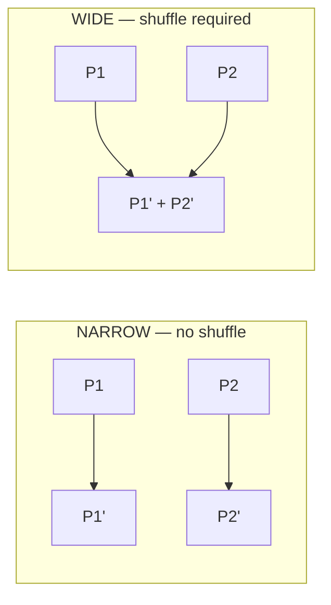

- **Narrow**: `map`, `filter`, `withColumn` — each output partition depends on only one input partition. No shuffle, stays in the same stage.
- **Wide**: `groupBy`, `join`, `repartition` — output partitions depend on multiple input partitions. Forces a shuffle → new stage boundary.

---

## 8. Optimization Techniques — the interview checklist

Go through these out loud as your "how would you optimize a slow Spark job" answer:

1. **Use DataFrame/SQL API over RDDs** — gets you Catalyst + Tungsten for free.
2. **Predicate & column pruning** — filter and select only what you need, as early as possible, so Catalyst can push filters down to the file scan (works great with columnar formats like Parquet).
3. **Use columnar file formats** — Parquet/ORC over CSV/JSON: compressed, columnar (reads only needed columns), stores schema, supports predicate pushdown.
4. **Partition your data on disk** by commonly-filtered columns (e.g. `date`) — enables **partition pruning**, skipping entire folders instead of scanning everything.
5. **Bucketing** — pre-shuffle data into a fixed number of buckets by a join/groupBy key at write time, so future joins on that key avoid a shuffle entirely.
6. **Broadcast joins** for small dimension tables (see above).
7. **Avoid UDFs when a built-in function exists** — Python UDFs break Catalyst's ability to optimize (they're a black box to the optimizer) and pay a serialization cost crossing the JVM↔Python boundary for every row. Use **Pandas UDFs (vectorized UDFs)** if you must use Python — they batch rows via Arrow and are much faster than row-at-a-time UDFs.
8. **Cache reused intermediate results** — but unpersist when done.
9. **Right-size partitions** — too few partitions = underutilized cluster; too many = scheduling overhead dominates. Rule of thumb target: partitions sized ~100–200MB each.
10. **Avoid `collect()` on large data** — pulls everything to the driver's memory; use `take(n)` or write to storage instead.
11. **Handle skew** — AQE, broadcast joins, salting (see Section 5).
12. **Tune shuffle partitions** — `spark.sql.shuffle.partitions` (default 200) is often wrong for your data size; too high on small data = tiny wasteful tasks, too low on big data = huge slow tasks. AQE's `coalescePartitions` mitigates this automatically.
13. **Use `explain()`** to verify the optimizer actually did what you expect (e.g. confirm a broadcast join really happened, confirm filters got pushed down).

---

## 9. Quick-fire interview Q&A

**Q: Why is Spark faster than Hadoop MapReduce?**
A: In-memory computation between stages (vs writing every intermediate result to disk in MR), a DAG execution engine (vs rigid map→reduce), and the Catalyst/Tungsten optimizer for DataFrames.

**Q: What's the difference between `repartition()` and `partitionBy()`?**
A: `repartition()` redistributes data across **in-memory** partitions (Spark-side). `partitionBy()` is used at **write time** to physically organize output into separate folders on disk by column value (e.g. `/year=2026/month=08/`), enabling partition pruning on future reads.

**Q: What causes an OutOfMemory error and how do you fix it?**
A: Usually data skew (one task/partition too big), too few partitions for the data volume, collecting too much data to the driver, or caching more than fits in memory. Fixes: repartition/salt to reduce partition size, avoid unnecessary `.collect()`, tune executor memory, use `MEMORY_AND_DISK` instead of `MEMORY_ONLY`.

**Q: What is lineage / the DAG used for besides planning?**
A: Fault tolerance. If an executor is lost, Spark recomputes only the lost partitions using the lineage graph instead of restarting the whole job.

**Q: `groupBy().count()` vs `countDistinct()` — which is more expensive?**
A: Both cause a shuffle, but distinct counting on high-cardinality columns is heavier — consider approximate methods (`approx_count_distinct`) when exactness isn't required, since it trades a small error margin for a much cheaper computation.

**Q: When would you *not* want to use `coalesce(1)`?**
A: When writing a large dataset — forcing everything into 1 partition means 1 task does all the write work serially, killing parallelism and often causing memory pressure. Fine for genuinely small outputs only.

---

## 10. One-page cheat sheet

```python
# Read
df = spark.read.schema(my_schema).parquet("path")   # explicit schema > inferSchema in prod

# Inspect the plan
df.explain(True)

# Partitioning
df.repartition(200)                 # full shuffle, even sizes, can increase
df.repartition("customer_id")       # repartition BY a column — co-locates keys before a join
df.coalesce(1)                      # cheap merge, decrease only, uneven sizes

# Broadcast join
from pyspark.sql.functions import broadcast
big.join(broadcast(small), "key")

# AQE (Spark 3.0+, default on in 3.2+)
spark.conf.set("spark.sql.adaptive.enabled", "true")
spark.conf.set("spark.sql.adaptive.skewJoin.enabled", "true")
spark.conf.set("spark.sql.adaptive.coalescePartitions.enabled", "true")

# Caching
df.cache()          # = persist(MEMORY_AND_DISK)
df.persist(StorageLevel.MEMORY_ONLY)
df.unpersist()

# Write with partitioning + bucketing
df.write.partitionBy("year", "month").parquet("path")
df.write.bucketBy(8, "customer_id").saveAsTable("bucketed_table")

# Vectorized (Pandas) UDF — prefer over row-at-a-time UDF
from pyspark.sql.functions import pandas_udf
@pandas_udf("double")
def add_tax(price: "pd.Series") -> "pd.Series":
    return price * 1.18
```

---

### How to use this document
Read Sections 1, 4, 5, and 6 first — architecture, coalesce/repartition, skew/AQE/broadcast, and caching are the four topics that come up in almost every PySpark data-engineering interview. Sections 7–9 are what separate a "knows the API" answer from a "has actually debugged a slow Spark job" answer — lead with those when asked open-ended optimization questions.
